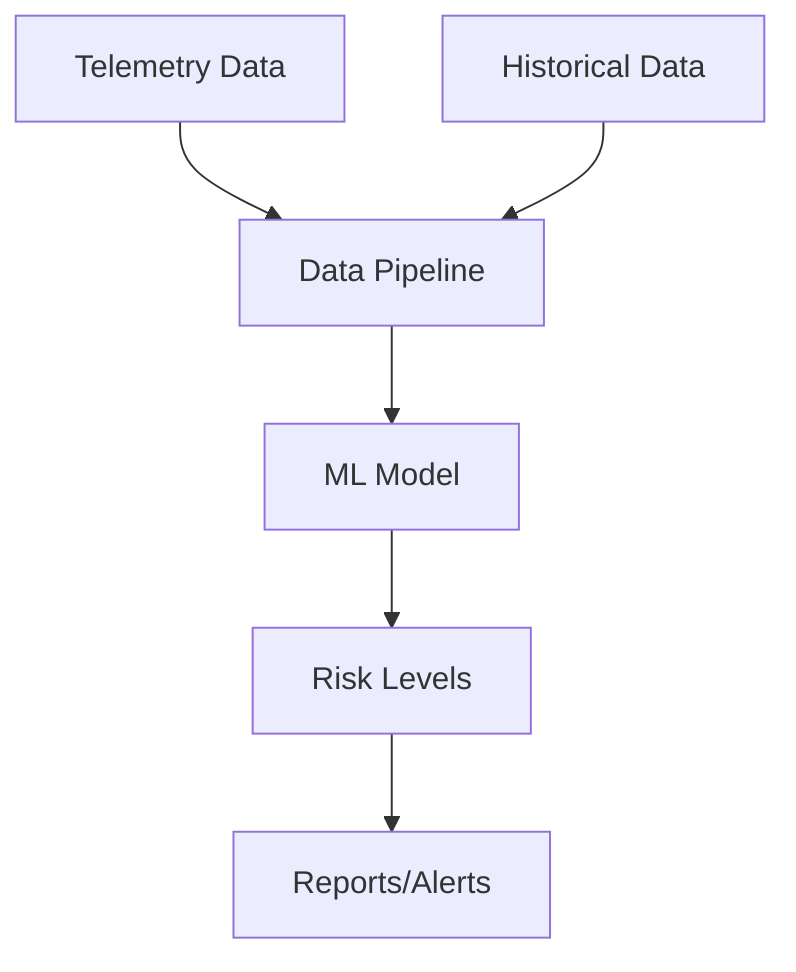

# Predictive Maintenance for Server Failure in Virtual Environments

## Overview
AI-powered system to predict and prevent server failures in virtualized environments. Combines real-time telemetry with public datasets to deliver actionable risk insights and reduce downtime.

## Features
- **Data Fusion**: Real-time (HWINFO, OHM, Zabbix) + public datasets (Azure, C-MAPSS, AI4I)
- **Modular ML Pipeline**: Preprocessing, feature engineering, training, inference
- **Risk Levels**: Low / Moderate / High / Critical with JSON/HTML output
- **Cross-Platform**: Tested on x86 systems; extendable to others

## System Requirements
- **Hardware**: x86-based server/workstation (e.g., AMD Ryzen 5 5600H, 16GB RAM)
- **Software**:
  - Python 3.11+, scikit-learn, XGBoost, imbalanced-learn
  - Monitoring: HWINFO, OHM, Zabbix Agent
  - JupyterLab for development

## Architecture

### 🔬 Feature Engineering
- Rolling statistics (mean, std, slope)
- Derived metrics (e.g., temperature-to-voltage ratios)
- Component interaction features

### 🤖 Model Training
- Algorithms: Random Forest, XGBoost, SVM
- Techniques: SMOTE for class imbalance, GridSearchCV for tuning
- Performance: Achieved AUC = 0.87

### ⏱️ Real-Time Integration
- Processes telemetry with ~1.6s latency
- Supports CSV and JSON I/O
- Generates interpretable risk reports
